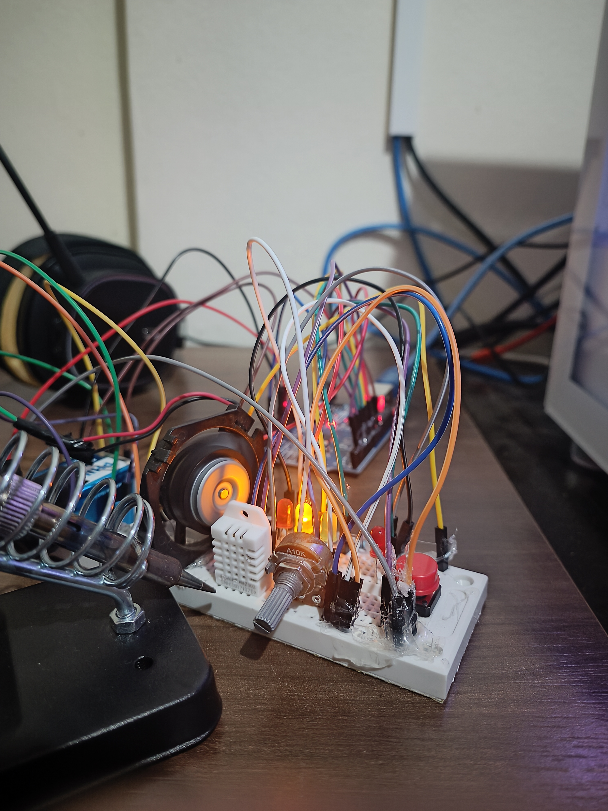
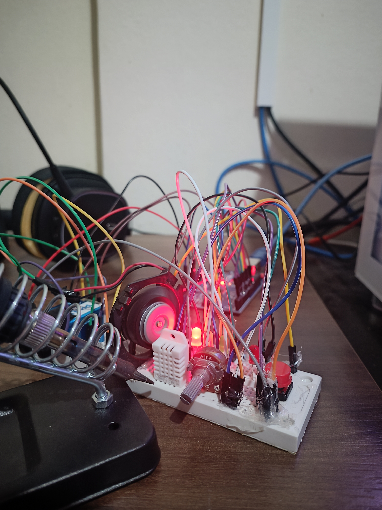
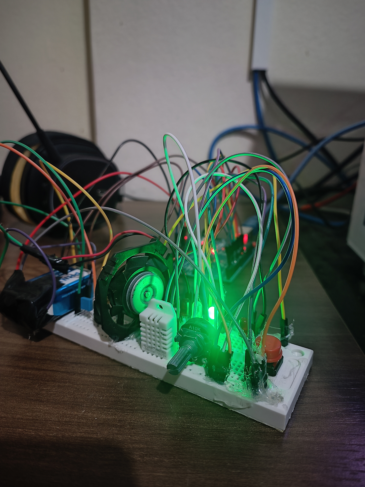
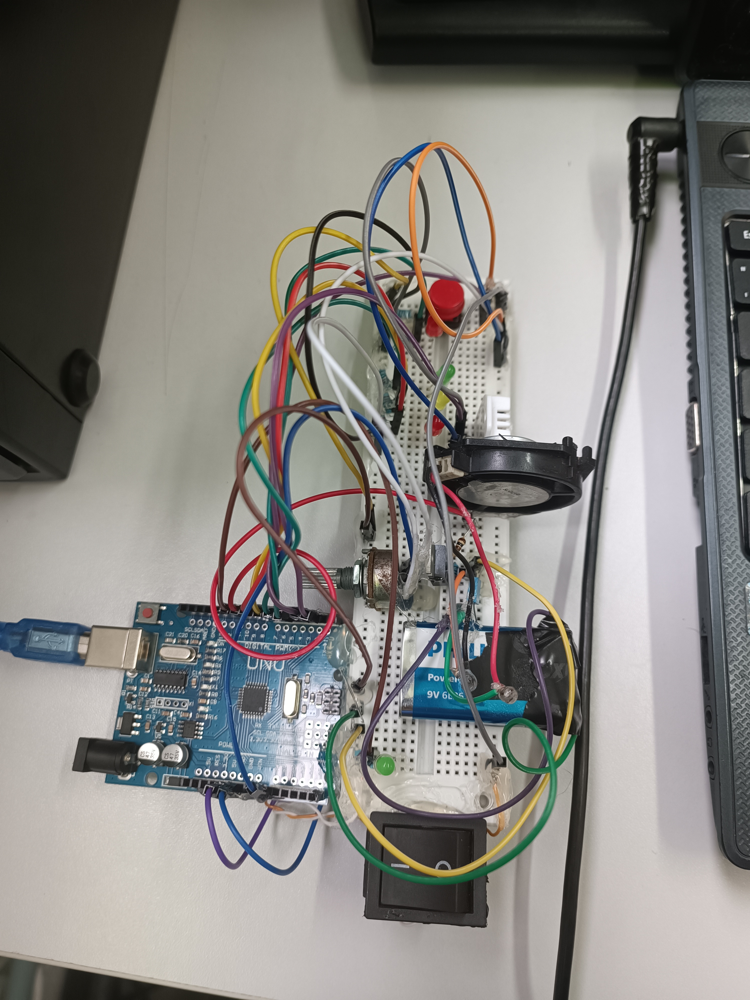

# 🌡️ Comunicação MODBUS RTU entre Arduino e Elipse E3 — Sistema Supervisório de Temperatura

Projeto desenvolvido para a disciplina de **Redes Industriais** (IFSC), com o objetivo de implementar uma comunicação **MODBUS RTU** entre um **PC** (mestre, rodando o supervisório **Elipse E3**) e um **Arduino Uno** (escravo), realizando a aquisição de sinais analógicos/digitais e o controle automático de um sistema de resfriamento baseado em temperatura.

> 👨‍💻 Autores: João Emiliano Helrighel Freitas e Guilherme Tomé
> 📚 Disciplina: Redes Industriais — Prof. Heron Ávila

---

## 🎥 Demonstração

Playlist com os vídeos de funcionamento do supervisório (tela configurada no Elipse E3 e testes práticos):

👉 [Assistir no YouTube](https://www.youtube.com/playlist?list=PLfn2nBdM7Qf2zB74IlvX79MMwnt03E4-D)

---

## 📋 Visão geral do projeto

O sistema simula uma aplicação de automação industrial em pequena escala: o Arduino lê um **sensor de temperatura (DHT22)** e um **potenciômetro**, e controla uma **ventoinha (PWM)** e um conjunto de **LEDs indicadores**, de acordo com faixas de temperatura pré-definidas. Todos os dados são disponibilizados via **MODBUS RTU** para o supervisório **Elipse E3**, que exibe os valores em tempo real (medidores, gauges, indicadores) e também é capaz de enviar comandos de volta ao Arduino.

### Lógica de controle (máquina de estados por temperatura)

| Estado | Faixa de temperatura | LED aceso | Ventoinha (PWM) |
|---|---|---|---|
| 🟢 **Normal** | 20,0 °C – 24,0 °C | Verde | Desligada (0) |
| 🟡 **Alerta** | 24,0 °C – 28,0 °C | Amarelo | Proporcional ao potenciômetro (70–200) |
| 🔴 **Emergência** | ≥ 28,0 °C | Vermelho | Máxima (255), ignora o potenciômetro |

- Na faixa de **alerta**, o usuário pode regular a velocidade da ventoinha através do potenciômetro, mas o sistema garante uma faixa mínima de resfriamento (PWM entre 70 e 200) para evitar que a ventoinha fique "fraca demais".
- Se mesmo com o potenciômetro no máximo a temperatura continuar subindo e ultrapassar o limite de emergência (28 °C), o controle manual é **sobrescrito** e a ventoinha vai para **100% de PWM (255)** automaticamente, priorizando a proteção do sistema.
- Um botão físico conectado ao Arduino também é lido via MODBUS (entrada digital) e pode forçar o LED vermelho principal ao máximo, servindo como um teste/override manual.

---

## 🛠️ Componentes utilizados

| Componente | Função |
|---|---|
| Arduino Uno | Processamento e escravo MODBUS RTU |
| Sensor de temperatura DHT22 | Leitura da temperatura ambiente |
| Potenciômetro 10 kΩ | Ajuste manual/referência analógica |
| MOSFET IRLZ44N (logic level) | Acionamento da ventoinha via PWM |
| Ventoinha DC 12V | Atuador de resfriamento |
| Capacitor eletrolítico 100 µF / 25V | Filtragem de ruído no acionamento |
| Resistores 10 kΩ e 220 Ω | Pull-up/pull-down e limitação de corrente dos LEDs |
| LEDs (verde, amarelo, vermelho) | Indicação visual do estado do sistema |
| Fonte de alimentação 9V | Alimentação da parte de potência |
| Protoboard + jumpers | Montagem experimental |
| PC com Elipse E3 Studio | Supervisório / mestre MODBUS |

---

## 🔌 Mapeamento de registradores MODBUS

O Arduino foi configurado como **escravo MODBUS RTU (ID 1, 9600 bps)**, utilizando as bibliotecas `modbus.h`, `modbusDevice.h`, `modbusRegBank.h` e `modbusSlave.h`.

| Endereço | Tipo | Pino Arduino | Descrição |
|---|---|---|---|
| 10002 | Discrete Input | D3 | Estado do botão |
| 30001 | Input Register | A0 | Leitura do potenciômetro (0–1023) |
| 30004 | Input Register | D2 (DHT22) | Temperatura × 10 (ex.: 25,3 °C → 253) |
| 40010 | Holding Register | D5 (PWM) | LED vermelho (PWM manual / override do botão) |
| 40011 | Holding Register | D6 | LED verde (indicador — normal) |
| 40012 | Holding Register | D7 | LED amarelo (indicador — alerta) |
| 40013 | Holding Register | D8 | LED vermelho 2 (indicador — emergência) |
| 40014 | Holding Register | D10 | LED verde 2 (comando auxiliar via supervisório) |
| 40015 | Holding Register | D9 (PWM) | Ventoinha (duty cycle 0–255) |

Essa separação segue o padrão MODBUS: **Discrete Inputs** e **Input Registers** para leitura (sensores), e **Holding Registers** para escrita/controle (atuadores).

---

## 💻 Código do Arduino

```cpp
#include <modbus.h>          // Biblioteca base do Modbus
#include <modbusDevice.h>    // Gerencia dispositivos Modbus
#include <modbusRegBank.h>   // Cria os registradores (Holding, Input, etc.)
#include <modbusSlave.h>     // Configura o Arduino como escravo Modbus
#include <DHT.h>             // Biblioteca para sensor DHT22 (temperatura/umidade)

// =======================================================================
// CONFIGURAÇÃO DO SENSOR DE TEMPERATURA
// =======================================================================
#define DHTPIN 2      // Pino onde o DHT22 está conectado
#define DHTTYPE DHT22 // Tipo do sensor: DHT22
DHT dht(DHTPIN, DHTTYPE); // Cria objeto do sensor DHT22 no pino 2

// =======================================================================
// OBJETOS MODBUS
// =======================================================================
modbusDevice regBank; // "Banco de registradores" do Modbus (memória simulada)
modbusSlave slave;    // Define o Arduino como um escravo Modbus

// =======================================================================
// VARIÁVEIS
// =======================================================================
word AI0;   // Variável para armazenar leitura do potenciômetro
word Temp;  // Variável para armazenar temperatura *10 (ex: 25,3°C → 253)

// =======================================================================
// CONFIGURAÇÃO INICIAL (setup)
// =======================================================================
void setup() {
  // Define o ID do slave (endereço Modbus)
  regBank.setId(1);

  // =====================================================================
  // CRIAÇÃO DOS REGISTRADORES NO BANCO MODBUS
  // =====================================================================
  regBank.add(10002);   // Discrete Input → botão (endereço 10002)
  regBank.add(30001);   // Input Register → potenciômetro (endereço 30001)
  regBank.add(30004);   // Input Register → sensor de temperatura (endereço 30004)

  // Holding Registers → usados como saída
  regBank.add(40010);   // LED vermelho (PWM) no pino 5
  regBank.add(40011);   // LED verde no pino 6
  regBank.add(40012);   // LED amarelo no pino 7
  regBank.add(40013);   // LED vermelho2 no pino 8
  regBank.add(40014);   // LED verde2 no pino 10
  regBank.add(40015);   // Ventoinha PWM no pino 9

  // Liga o banco de registradores ao escravo
  slave._device = &regBank;
  slave.setBaud(9600); // Define a taxa de comunicação Modbus (9600 bps)

  // =====================================================================
  // CONFIGURAÇÃO DOS PINOS DO ARDUINO
  // =====================================================================
  pinMode(3, INPUT_PULLUP); // Botão no pino D3 → entrada digital com pull-up
  pinMode(5, OUTPUT);       // LED vermelho (PWM no pino D5)
  pinMode(6, OUTPUT);       // LED verde
  pinMode(7, OUTPUT);       // LED amarelo
  pinMode(8, OUTPUT);       // LED vermelho2
  pinMode(9, OUTPUT);       // Ventoinha (PWM no pino D9)
  pinMode(10, OUTPUT);      // LED verde2

  dht.begin(); // Inicializa o sensor DHT22
}

// =======================================================================
// LOOP PRINCIPAL
// =======================================================================
void loop() {
  // =====================================================================
  // BOTÃO
  // =====================================================================
  byte DI3 = digitalRead(3);   // Lê botão no pino D3
  regBank.set(10002, DI3);     // Atualiza valor no registrador Modbus (10002)

  // =====================================================================
  // POTENCIÔMETRO
  // =====================================================================
  AI0 = analogRead(A0);        // Lê valor analógico do potenciômetro (0–1023)
  regBank.set(30001, AI0);     // Armazena no registrador Modbus (30001)

  // =====================================================================
  // SENSOR DE TEMPERATURA (DHT22)
  // =====================================================================
  float t = dht.readTemperature();  // Lê temperatura em °C
  if (!isnan(t)) {                  // Se a leitura for válida
    Temp = (word)(t * 10);          // Multiplica por 10 (25,3°C → 253)
    regBank.set(30004, Temp);       // Salva no registrador Modbus (30004)
  }

  // =====================================================================
  // LED VERMELHO PWM (pino 5)
  // =====================================================================
  word pwmVal = regBank.get(40010); // Lê valor desejado no registrador (0–255)
  if (DI3 == HIGH) {                // Se o botão for pressionado
    pwmVal = 255;                   // LED vermelho fica no máximo
  }
  if (pwmVal > 255) pwmVal = 255;   // Garante que não passe de 255
  analogWrite(5, pwmVal);           // Aplica PWM no LED vermelho

  // =====================================================================
  // LEDS DE TEMPERATURA (Verde, Amarelo, Vermelho2)
  // =====================================================================
  if (Temp >= 200 && Temp < 240) { // Entre 20,0°C e 24,0°C
    digitalWrite(6, HIGH);  // Verde ligado
    digitalWrite(7, LOW);   // Amarelo desligado
    digitalWrite(8, LOW);   // Vermelho2 desligado
    regBank.set(40011, 1);
    regBank.set(40012, 0);
    regBank.set(40013, 0);
  } else if (Temp >= 240 && Temp < 280) { // Entre 24,0°C e 28,0°C
    digitalWrite(6, LOW);
    digitalWrite(7, HIGH);  // Amarelo ligado
    digitalWrite(8, LOW);
    regBank.set(40011, 0);
    regBank.set(40012, 1);
    regBank.set(40013, 0);
  } else if (Temp >= 280) { // Acima de 28,0°C
    digitalWrite(6, LOW);
    digitalWrite(7, LOW);
    digitalWrite(8, HIGH);  // Vermelho2 ligado
    regBank.set(40011, 0);
    regBank.set(40012, 0);
    regBank.set(40013, 1);
  } else { // Abaixo de 20,0°C → todos desligados
    digitalWrite(6, LOW);
    digitalWrite(7, LOW);
    digitalWrite(8, LOW);
    regBank.set(40011, 0);
    regBank.set(40012, 0);
    regBank.set(40013, 0);
  }

  // =====================================================================
  // LED VERDE2 (pino 10)
  // =====================================================================
  word ledVerde2 = regBank.get(40014); // Lê registrador (40014)
  if (ledVerde2 == 1) {
    digitalWrite(10, HIGH); // Liga LED verde2
  } else {
    digitalWrite(10, LOW);  // Desliga LED verde2
  }

  // =====================================================================
  // VENTOINHA PWM (pino 9)
  // =====================================================================
  int pwmVentoinha = 0; // Variável para duty cycle da ventoinha
  if (Temp < 240) {
    // Abaixo de 24,0 °C → ventoinha desligada
    pwmVentoinha = 0;
  } else if (Temp >= 240 && Temp < 280) {
    // Entre 24,0 °C e 28,0 °C → ventoinha proporcional ao potenciômetro
    // Garante um valor entre 70 e 200 (não fica muito fraca)
    pwmVentoinha = map(AI0, 0, 1023, 70, 200);
  } else if (Temp >= 280) {
    // Acima de 28,0 °C → velocidade máxima
    pwmVentoinha = 255;
  }
  analogWrite(9, pwmVentoinha);       // Aplica PWM na ventoinha
  regBank.set(40015, pwmVentoinha);   // Salva duty cycle no registrador (40015)

  // =====================================================================
  // ATUALIZA O MODBUS
  // =====================================================================
  slave.run(); // Mantém comunicação Modbus funcionando
}
```

> ℹ️ Bibliotecas necessárias: [Arduino-Modbus-Slave (`modbus.h`/`modbusSlave.h`)](https://github.com/AndrasNemeth/Modbus_Slave) e [DHT-sensor-library da Adafruit](https://github.com/adafruit/DHT-sensor-library).

---

## 🖥️ Configuração no Elipse E3

No supervisório **Elipse E3 Studio**, foi configurado o **driver MODBUS RTU** para se comunicar com o Arduino, definindo:

- Porta serial
- Baud rate: **9600 bps**
- Endereço do escravo (ID 1)
- Paridade

Em seguida, foram criadas as **tags de comunicação** vinculadas a cada registrador do Arduino:

| Tag no Elipse | Registrador MODBUS |
|---|---|
| Sensor de Temperatura | 30004 |
| Potenciômetro | 30001 |
| Ventoinha (PWM) | 40015 |
| Led Vermelho (PWM) | 40010 |
| Led Verde | 40011 |
| Led Amarelo | 40012 |
| Led Vermelho 2 | 40013 |
| Led Verde 2 | 40014 |

A partir dessas tags, foi construída a tela de supervisório com: medidor de temperatura, gauge do potenciômetro, indicador de rotação da ventoinha, controle/slider de PWM dos LEDs e indicador de status do botão.

---

## 📁 Estrutura do repositório

```
├── Codigos_Arduino/
│   └── Modbus_Arduino.ino              # Código-fonte do Arduino (ver seção acima)
├── Configuracao_Supervisorio/
│   ├── Modbus.dll                      # Driver MODBUS para o Elipse E3
│   ├── ModbusSlave.zip                 # Biblioteca Modbus Slave usada no Arduino
│   └── Projeto_Supervisorio_Completo/
│       └── Modbus_Arduino/             # Projeto completo do Elipse E3 (.prj, .dom, .lib)
├── Driver_Modbus/                      # Documentação e manuais do driver Modbus (PDF/CHM)
├── Imagens_ElipseE3_Interface/         # Fotos da interface do supervisório e do circuito montado
├── Comunicacao_Arduino_MODBUS_RTU.pptx # Apresentação do projeto
├── Comunicacao_Arduino_Elipse_E3_MODBUS_RTU.pdf
├── Relatorio_Arduino_Modbus.docx       # Relatório técnico completo do projeto
├── Diretrizes_do_Trabalho.pdf          # Enunciado/requisitos da disciplina
└── README.md
```

---

## 📸 Galeria

Fotos do circuito montado e da tela do supervisório (pasta `Imagens_ElipseE3_Interface/`):

<p align="center">
  
  
  <br/>
  
  
</p>

> Se você for adicionar mais fotos (dos LEDs verde/amarelo/vermelho isolados ou da tela do Elipse E3), basta salvá-las dentro de `Imagens_ElipseE3_Interface/` e referenciá-las aqui do mesmo jeito.

---

## ✅ Resultados

Os testes práticos confirmaram que os três estados do sistema (normal / alerta / emergência) refletem corretamente entre o circuito real e a interface do Elipse E3:

1. **Teste 1 – Normal:** LED verde aceso, ventoinha desligada, valores no supervisório condizentes com a leitura real.
2. **Teste 2 – Alerta:** LED amarelo aceso, ventoinha operando entre ~28% e ~78% de PWM (ajustável via potenciômetro).
3. **Teste 3 – Emergência:** LED vermelho aceso, ventoinha travada em 100% de PWM, controle manual via potenciômetro desativado para priorizar o resfriamento.

## 🚧 Dificuldades e aprendizados

- Configuração inicial do driver MODBUS RTU no Elipse E3.
- Mapeamento correto dos registradores (Discrete Inputs, Input Registers e Holding Registers) e sincronismo entre supervisório e Arduino.
- Consolidação de conceitos de **protocolos industriais**, **automação** e **sistemas supervisórios**.

## 💡 Sugestões de melhorias futuras

- Integração com banco de dados para registro histórico das medições e comandos (data logging).
- Geração de alarmes e relatórios automáticos no supervisório.
- Substituição da comunicação serial RS-232/USB por RS-485 para maior robustez em ambientes industriais reais.

---

## 📚 Referências

- Adafruit, *DHT-sensor-library*, GitHub, 2013. Disponível em: https://github.com/adafruit/DHT-sensor-library
- Vishay, *IRLZ44 — Power MOSFET*, Datasheet S21-1045 Rev. D, 2021. Disponível em: https://www.vishay.com/docs/91328/irlz44.pdf
- Tekon Electronics, *Protocolo de comunicação Modbus*. Disponível em: https://www.tekonelectronics.com/pt/media/tekon-blog/protocolo-comunicacao-modbus/

---

## 👥 Autores

- **João Emiliano Helrighel Freitas** — joao.hf@aluno.ifsc.edu.br
- **Guilherme Tomé** — guilherme.e06@aluno.ifsc.edu.br

Projeto acadêmico desenvolvido para a disciplina de **Redes Industriais**, Instituto Federal de Santa Catarina (IFSC).
